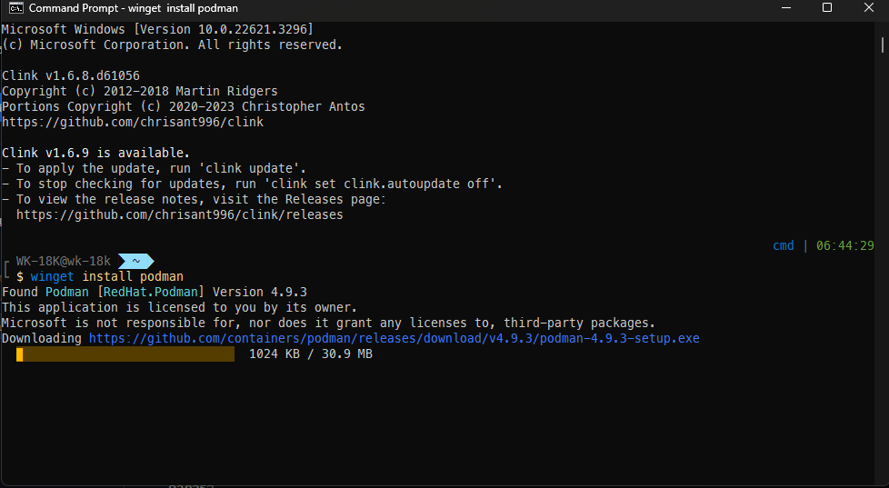
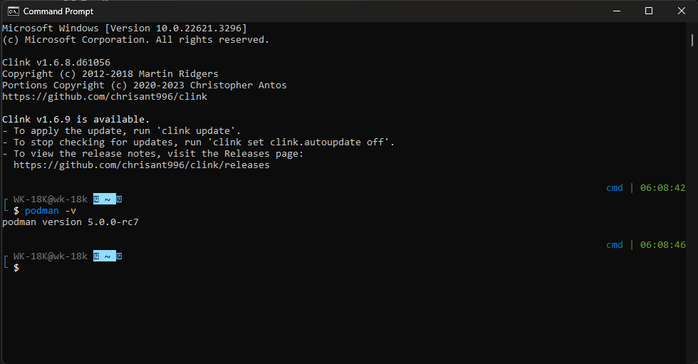

# Podman Template

## Download

ติดตั้ง winget ก่อน

- https://apps.microsoft.com/detail/9nblggh4nns1?rtc=1&hl=th-th&gl=TH#activetab=pivot:overviewtab

จากใช้คำสั่ง

```
winget install podman
```



## ทดสอบ



```
podman -v
```

## สร้างเครื่องจำลองขึ้นครั้งแรก

```
podman machine init --cpus 1 --memory 1048
```

## เข้าใช้งาน

```
podman machine start
```

## เข้าไปภายในเครื่องจำลอง

```
podman machine ssh
```

## คำสั่งเช็ค Memory


```
free -h --giga

exit
```

## ตั้งค่าการใช้ Resource ของ เครื่องจำลอง

- ไปที่ `C:\Users\%USERPROFILE%\`
- สร้างไฟล์ที่ชื่อว่า `.wslconfig` ขึ้นมา
- และเอาข้อมูลนี้ไปใส่

```
[wsl2]
memory=1GB
processors=1
```

- หรือโหลดได้ที่ไฟล์ [`.wslconfig`](https://github.com/InternBNDEV-golang/podman-template/blob/master/.wslconfig)

- จากนั้น restart wsl

```
wsl --shutdown
```


- แล้วทำการ

```
podman machine start
```

- ใหม่จากนั้นก็ได้

```
podman machine ssh
```

- ทำการเช็คแรมได้เลย

```
free -h --giga
```

## ย้าย เครื่องจำลอง ไปที่ไดร์อื่น กรณี drive C จะเต็ม

- หยุด podman VM ของคุณ

```
podman machine stop
```

- และ

```
wsl --shutdown
```

- จากนั้นไปที่โฟลเดอร์นี้แล้วคัดลอก `podman-machine-default` มาที่ตำแหน่ง

```
%USERPROFILE%\.local\share\containers\podman\machine\wsl\wsldist\
```

- จากนั้นไปสร้างโฟลเดอร์ใหม่ที่ drive อื่นเพื่อเก็บ machine ตัวนี้ไว้แล้วทำการวางที่คัดลอกไว้ที่นั่นได้เลย เช่น `G:/podman/machine`
- ตรวจสอบให้แน่ใจว่าคุณมีข้อมูลสำรองแล้วที่คัดลอกไปแล้วจากนั้นใช้คำสั่ง

```
wsl --unregister podman-machine-default
```

_สิ่งนี้จะลบ vhdx เดิมทิ้งหรือที่เราไปคัดลอกมานั่นเอง_

- นำเข้าจาก vhdx ที่คุณเพิ่งคัดลอกไปยังไดรฟ์อื่นมาใช้

```
wsl --import-in-place podman-machine-default Z:\machine-wsl\podman-machine-default\ext4.vhdx
```

_`Z:\machine-wsl` ตรงนี้้ให้เปลี่ยนตามชื่อโฟลเดอร์ที่คุณสร้างขึ้น_

## มารัน Image แรก

```
podman pull docker.io/library/httpd
podman run -dt -p 8080:80/tcp docker.io/library/httpd
```

- จากนั้นไปที่ `http://localhost:8080/`

- `podman ps` เพื่อดู VM ที่กำลังทำงานอยู่
- `podman container stop <ID NAME>` เพื่อหยุด VM ที่กำลังทำงาน `<ID NAME>` จะได้มาจาก name จาก `podman ps`

## ใช้ Dockerfile

- ทำการ build ก่อนนึงรอบด้วยคำสั่ง

```
podman build -t api .
```

- จากนั้นรันได้ด้วยคำสั่ง

```
podman run -it -p 8000:3000 api
```

_8000:3000 ตรงนี้ 8000 คือ port ที่เราจะจากเครื่องเรา และ 3000 คือ port ของ VM ที่เปิด สามารถเปลี่ยนเป็น 3000:3000 ได้เหมือนกัน_

- จากนั้นทดสอบที่ `http://127.0.0.1:8000/` ได้เลย

- ถ้าจะหยุดเซิฟเวอร์ต้องกด Ctrl + C
- เราสามารถให้มันทำงานเบื้องหลังได้ด้วยคำสั่ง

```
podman run -dt -p 8000:3000 api
```

- เช็คการทำงาน VM ด้วย `podman ps`

- หรือสามารถรวมคำสั่งในบรรทัดเดียว `podman build -t api . && podman run -dt -p 8000:3000 --name=api-test api` แนะนำแค่รันครั้งแรกเท่านั้น ถ้าเคย build แล้วไม่มีการแก้ไขอะไรในโค้ดก็ใช้ run ธรรมดาได้เลยไม่ต้อง build เราจะ build กรณี มีการแก้ไขโค้ดพวกนี้

- `podman stats` ใช้เพื่อดูสถิติการใช้ทรัพยากรณ์ของเครื่อง แต่ต้อง `podman machine set --rootful` ไม่งั้นสิทธิ์จะไม่ถึง

# ลบ Container ได้ด้วยคำสั่ง

```
podman container stop <ID>
podman container rm <ID>
```

# รัน Container แบบจำกัด Memory

```
podman run -dt -p 8000:3000 --name=api-test -m 256m -memory-swap 256m api
```

# คำสั่งดู Container ทั้งหมด

```
podman ps
podman ps -a
```

# คำสั่งดู Image ทั้งหมด

```
podman images
```

## วิธีถอนการติดตั้ง machine

- https://github.com/containers/podman/issues/17395
- ลบโฟลเดอร์พวกนี้

```
%USERPROFILE%\.local\share\containers\podman\machine\wsl
%USERPROFILE%\.config\containers\podman\machine
%USERPROFILE%\AppData\Roaming\containers

%USERPROFILE%\.ssh\podman-machine-default.pub
```
